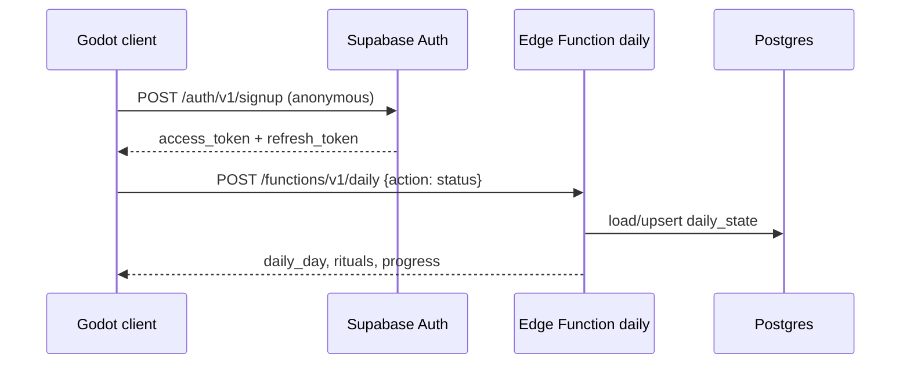

# Familiar's Call — Supabase backend

Daily rituals, pack claims, and ritual rewards use **Supabase** (Postgres + Auth + Edge Functions). HTTPS is included automatically on your project URL.

The legacy Python server in `server/` is **deprecated** — use this instead.

## What you get

| Feature | How |
|---------|-----|
| HTTPS | `https://YOUR_PROJECT.supabase.co` |
| Player identity | Anonymous auth (upgrade to Google/Apple later) |
| Daily state | `daily_state` table + `daily` Edge Function |
| Display name | `profiles` table, synced from the game |

## One-time setup

### 1. Create a Supabase project

1. [supabase.com/dashboard](https://supabase.com/dashboard) → **New project**
2. Note your **Project URL** and **anon public** key (Settings → API)

### 2. Enable anonymous sign-in

**Authentication → Providers → Anonymous sign-ins → Enable**

Without this, the game cannot sign players in.

**Supabase will warn:** *“Anonymous users will use the authenticated role.”* That is expected. This project is configured so anonymous players:

| Access | Allowed? |
|--------|----------|
| Read **own** `profiles` / `daily_state` row | Yes (RLS: `auth.uid() = user_id`) |
| Read **other** players’ data | No |
| Insert/update/delete tables directly from the client | No (no write policies; grants revoked) |
| Change dailies, claim pack, complete rituals | Only via the **`daily` Edge Function** (service role) |

After enabling anonymous sign-ins, run **both** migrations (or `supabase db push`):

1. `20250702000000_daily_schema.sql`
2. `20250702000001_harden_rls_anonymous.sql` — revokes client write grants

### 3. Run the database migration

**SQL Editor → New query** → paste and run each file in `supabase/migrations/` **in order** → **Run**

Or with the [Supabase CLI](https://supabase.com/docs/guides/cli):

```bash
supabase login
supabase link --project-ref YOUR_PROJECT_REF
supabase db push
```

### 4. Deploy the Edge Function

**Option A — double-click (Windows)**

```
supabase\deploy.bat
```

First time only, it will ask you to run `npx supabase login` and link your project.

**Option B — terminal**

PowerShell blocks `npx` by default on Windows. Use **`npx.cmd`** instead, or open **cmd.exe** (not PowerShell):

```cmd
cd /d C:\Users\dioni\Documents\FAMILI~1
npx.cmd supabase login
npx.cmd supabase link --project-ref YOUR_PROJECT_REF
npx.cmd supabase db push
npx.cmd supabase functions deploy daily
```

`YOUR_PROJECT_REF` = Dashboard → **Settings → General → Reference ID** (20 characters).

To fix PowerShell permanently (optional): `Set-ExecutionPolicy -Scope CurrentUser RemoteSigned`

**Option C — Supabase Dashboard (no CLI)**

1. **Edge Functions → Create function** → name: `daily`
2. Paste code from `supabase/functions/daily/index.ts` and shared files from `supabase/functions/_shared/`
3. Deploy from the dashboard UI

The function uses `SUPABASE_URL`, `SUPABASE_ANON_KEY`, and `SUPABASE_SERVICE_ROLE_KEY` automatically in production.

### 5. Configure the game

**Debug build:** Settings → Developer

- **Cloud dailies (Supabase)** → ON
- **Supabase URL** → `https://YOUR_PROJECT.supabase.co`
- **Anon key** → your anon public key
- Tap **Ping**, then **Sync**

**Release build:** edit `data/backend_config.json`:

```json
{
  "enabled": true,
  "supabase_url": "https://YOUR_PROJECT.supabase.co",
  "supabase_anon_key": "eyJhbGciOiJIUzI1NiIsInR5cCI6IkpXVCJ9..."
}
```

The anon key is safe to ship in the client (it is public by design). Row writes go through the Edge Function with the service role.

## How the game talks to Supabase



Actions sent to the `daily` function:

| `action` | Purpose |
|----------|---------|
| `status` | Sync today's rituals (default) |
| `claim_pack` | Mark daily page claimed |
| `record_battle_win` | Increment battle win count |
| `complete_ritual` | Mark ritual done + dust grant metadata |

## Local Supabase (optional)

```bash
supabase start
supabase db reset
supabase functions serve daily
```

Use the local URL and anon key printed by `supabase status` in the dev panel.

## Cost

Supabase **free tier** includes Auth, database, and Edge Function invocations with limits — typically enough for early development and soft launch. Check [supabase.com/pricing](https://supabase.com/pricing).

## Next steps (not built yet)

- Link Google / Apple to the same `auth.users` row
- Cloud Grimoire save in `profiles` or separate tables
- Server-side ritual verification (battle stats)
- Replace anonymous auth with required sign-in for production
